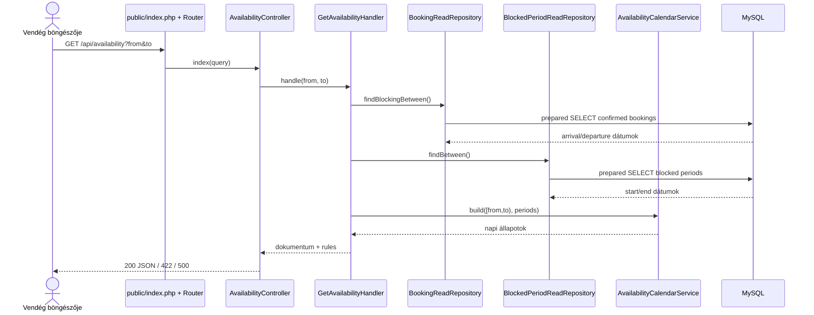
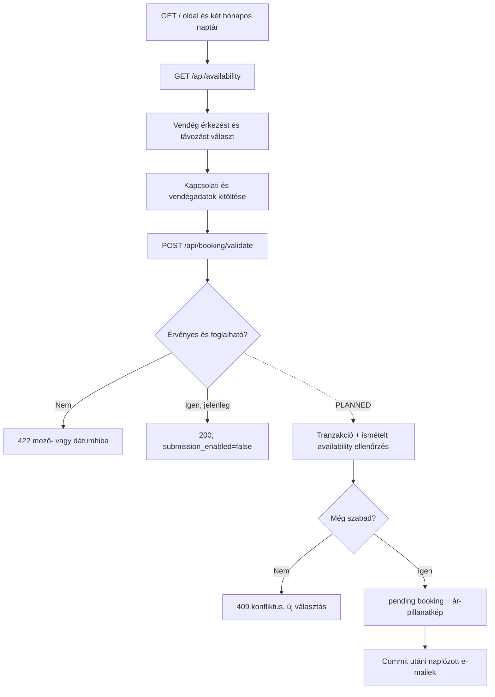
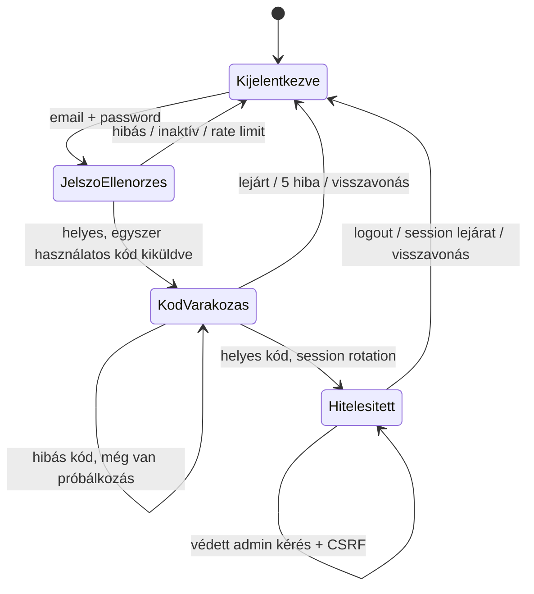
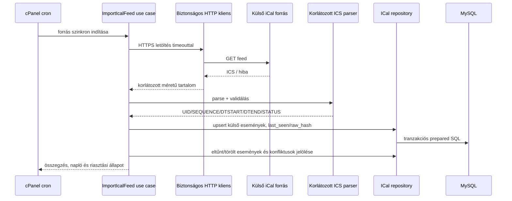

# Architektúra

**Állapot:** IMPLEMENTED architektúra-leltár és PLANNED 1.0 célarchitektúra
**Utolsó ellenőrzött commit:** `9adc564`

## Hatókör és alapelvek

Az alkalmazás frameworkfüggetlen, rétegezett PHP 8.2+ monolit egyetlen szálláshelyhez. A jelenlegi kód kis mérete miatt a kompozíció a front controllerben történik. Az 1.0 cél továbbra is cPanel-kompatibilis, Node.js nélküli production runtime.

Architekturális alapelvek:

- **IMPLEMENTED:** `public/` az egyetlen weben publikált könyvtár;
- **IMPLEMENTED:** Composer PSR-4 az `App\` névtérhez;
- **IMPLEMENTED:** a domain dátumlogika PDO-tól és HTTP-től független;
- **IMPLEMENTED:** az Application repository interfészeit az Infrastructure PDO adapterei valósítják meg;
- **IMPLEMENTED:** a dinamikus SQL értékek prepared statementtel kerülnek a lekérdezésekbe;
- **PLANNED:** az írási use case-ek tranzakcióhatára az Application rétegben vagy külön unit-of-work absztrakció mögött legyen;
- **PLANNED:** a HTTP authentikáció, CSRF, rate limit és hibakezelés központi middleware-szerű rétegben legyen, ne controllerekben ismétlődjön.

## Jelenlegi könyvtárstruktúra

```text
bin/                         CLI belépési pontok: migráció, DB-check, demo seed
config/                      PHP konfigurációs tömbök
database/migrations/         sorrendezett, verziózott SQL migrációk
docker/php/                  PHP 8.2 + Apache fejlesztői image és vhost
public/                      front controller és build nélküli statikus assetek
src/Application/Availability use case és read-repository portok
src/Domain/Availability/     napi foglaltsági modell és domain service
src/Domain/Booking/          fél-nyitott időszak és overlap szabály
src/Http/                    router, JSON válasz és controllerek
src/Infrastructure/Database/ PDO kapcsolat és migrációfuttató
src/Infrastructure/Persistence/ PDO read-repository adapterek
templates/booking/           publikus szerveroldali HTML template
tests/                       unit, feature és integration tesztek
```

**PLANNED:** Az új modulok ugyanezt a réteghatárt kövessék, például `Application/Booking`, `Application/AdminAuth`, `Application/Pricing`, `Application/Ical`; a tiszta üzleti modellek a megfelelő `Domain/*`, az SMTP/PDO/HTTP/ICS adapterek az `Infrastructure/*`, a webes belépési pontok a `Http/Controller` alatt kapjanak helyet. Részletes moduligények: [admin](04_ADMIN_AND_AUTHENTICATION.md), [pricing](05_PRICING.md), [e-mail](06_EMAIL_WORKFLOWS.md), [iCal](07_ICAL_SYNC.md).

## Webes request flow

### Front controller és router

**IMPLEMENTED:** Az Apache minden nem létező fájlkérést a `public/index.php` fájlra irányít. A front controller:

1. betölti a Composer autoloadert;
2. beállítja az időzónát, alapértelmezetten `Europe/Budapest` értékre;
3. példányosítja a `Router` és `HomeController` objektumokat;
4. regisztrálja az öt jelenlegi route-ot;
5. az API closure-ökben létrehozza a PDO-t, repositorykat, handlert és controllert;
6. a HTTP metódus és az URI path alapján dispatch-el.

A router egzakt útvonalillesztést, `GET` és `POST` regisztrációt tud. A handler mindig megkapja a `$_GET` tömböt; route paraméter, middleware, content negotiation és automatikus dependency injection nincs. Ismeretlen metódus/útvonal JSON `404` választ kap.

### Controller–Application–Domain–Infrastructure felelősségek

| Réteg | Jelenlegi felelősség | Nem tartozhat ide |
|---|---|---|
| HTTP controller | input alakítása, use case hívása, HTTP/JSON válasz | SQL, tartós üzleti szabály |
| Application | use case koordináció, dátum input validálása, repository portok | PDO-specifikus lekérdezés, HTML |
| Domain | `BookingPeriod`, overlap, napi státusz és választhatóság | HTTP státuszkód, környezeti változó |
| Infrastructure | PDO kapcsolat, SQL read adapter, migráció | UI és üzleti döntés |
| Template / JS | megjelenítés, kliensinterakció, elővalidáció | végső availability döntés és adatbázisírás |

**IMPLEMENTED kivétel:** A `BookingValidationController` több üzleti jellegű szabályt (blokkoló napi státuszok, éjszakaszám, horizont) közvetlenül koordinál. **PLANNED:** mentés előtt ezt külön Application use case-be kell áthelyezni, hogy HTTP nélkül is tesztelhető, újrahasznosítható és tranzakcióba foglalható legyen.

## Repository absztrakció és adatfolyam

**IMPLEMENTED:** A `BookingReadRepository` és `BlockedPeriodReadRepository` portok az Application rétegben találhatók, és `BookingPeriod` listákat adnak vissza. A PDO adapterek fél-nyitott overlap feltétellel kérdeznek:

```text
stored_start < requested_to AND stored_end > requested_from
```

A booking adapter konfigurálható blokkoló státuszlistát használ; jelenleg ez `['confirmed']`. Csak dátumokat olvas, ezért az availability válaszba nem kerül vendég-PII.

**PLANNED:** Írásra külön repository portok szükségesek. Az availability read portot nem szabad vendégadat-entitással kibővíteni. Mentéskor a konkurenciavédelmet adatbázis-tranzakcióval és dokumentált zárolási stratégiával kell megoldani.

> **DECISION REQUIRED:** MySQL advisory lock, külön naptárnap-lock tábla vagy más tranzakciós zárolás legyen-e az egyetlen szálláshely dupla foglalást kizáró mechanizmusa. A puszta „lekérdezés, majd INSERT” nem elegendő.

## Publikus availability kérés



Szövegesen: a controller szigorú `YYYY-MM-DD` inputot ad a handlernek. A handler legfeljebb 93 napot fogad, két read repositoryból kér fél-nyitott intervallummal átfedő időszakokat, majd a domain service napi állapotokat képez. A horizonton túli napok választhatóságát a handler tiltja. Hibás tartomány `422`, váratlan hiba általános `500`; a válasz jelszót és vendégadatot nem tartalmaz. Részletes kontraktus: [API referencia](08_API_REFERENCE.md).

## Publikus foglalási folyamat



Szövegesen: **IMPLEMENTED** a naptár betöltése, kliensoldali kijelölés és a mentés nélküli szervervalidáció. **PLANNED** az írási ág: a szerver nem bízhat a kliens naptárában, ezért tranzakción belül újraellenőriz, ütközéskor nem ír, siker esetén idempotensen ment, majd csak commit után indít e-mail folyamatot. A részletes user journey a [publikus foglalási folyamatban](03_PUBLIC_BOOKING_FLOW.md) található.

## Admin authentikáció



Szövegesen: a Sprint 3 auth folyamat **IMPLEMENTED**. Az első faktor után rövid életű, hashelt e-mailes kód készül, a rendszer korlátozza a próbálkozást és újraküldést, siker után session ID-t rotál, védett cookie-t használ, minden auth POST-on CSRF-et ellenőriz, logoutkor visszavon. A teljes admin üzleti felület **PLANNED**. Részletek: [admin és hitelesítés](04_ADMIN_AND_AUTHENTICATION.md), [biztonság](09_SECURITY.md).

## iCal import



Szövegesen: ez **DEFERRED**, kód és séma még nincs. A cron forrásonként korlátozott hálózati letöltést végez, a parser egész napos `[DTSTART, DTEND)` eseményeket validál, majd `UID` és forrás alapján idempotensen frissít. A külső eseményt nem szabad belső bookingként összemosni; eltűnés, `CANCELLED`, konfliktus és saját feed visszaimportálása külön állapot. Az iCal nem valós idejű. Elfogadás: SSRF-védelem, méret/időkorlát, ismételt futás idempotenciája, cancellation/eltűnés/loop/conflict tesztek és auditálható utolsó siker. Részletek: [iCal szinkron](07_ICAL_SYNC.md).

## Konfigurációkezelés

**IMPLEMENTED:**

- a Docker Compose ugyanazon `.env` `DB_*` változóiból adja át az app és MySQL inicializáló credentialjeit;
- a `config/database.php` minden DB-változót kötelezően ellenőriz, a portot `1..65535` tartományra validálja;
- a `config/booking.php` kódban rögzíti a minimum 1, maximum 30 éjszakát, 365 napos horizontot, 93 napos API maximumot és a `confirmed` blokkoló státuszt;
- a CLI scriptek egyszerűen beolvassák a lokális `.env` fájlt, ha a folyamat környezete még nem adott értéket;
- a `db:check` hostot, adatbázist és felhasználót jelezhet, jelszót nem.

**PLANNED:** Egységes bootstrap/config loader szükséges a web és CLI ismétlésének kiváltására. Az üzletileg módosítható szabályok forrását (`config/booking.php` vagy `settings`) és cache-elését rögzíteni kell.

> **DECISION REQUIRED:** Mely beállításokat szerkesztheti admin, hogyan történik a típusos validáció és mi a konfigurációs fájl–adatbázis prioritás.

## Adatbázis-kapcsolat és migráció

**IMPLEMENTED:** A `ConnectionFactory` `utf8mb4` DSN-t, exception hibamódot, asszociatív fetch módot és valódi prepared statementeket állít be. Minden webes API kérés új PDO kapcsolatot és dependency gráfot épít.

**IMPLEMENTED:** A `Migrator` név szerint rendezi a `database/migrations/*.sql` fájlokat. Létrehozza a ténylegesen `migrations` nevű naplótáblát, ellenőrzi a fájlnevet, lefuttatja az SQL-t, majd siker után rögzíti a verziót. Rollback nincs. MySQL DDL implicit commit miatt egy többutasításos migráció nem garantáltan atomi.

**PLANNED:** Production előtt szükséges előzetes backup, forward-fix stratégia, maintenance/kompatibilitási ellenőrzés és dokumentált kézi rollback terv. Meglévő migrációt módosítani tilos; új séma csak új verziózott fájlban készülhet.

## Exception- és JSON-válaszkezelés

**IMPLEMENTED:** A `JsonResponse` központilag állít státuszt és UTF-8 JSON content type-ot. Az availability tartományhiba `InvalidAvailabilityRange` kivétellel `422`; a váratlan hibák szándékosan általános `500` üzenetet kapnak. A router `404` JSON-t ad. A `HomeController` saját privát JSON helperrel válaszol a `/health` és placeholder route-ra.

**Kockázat:** több szinten történik `Throwable` elkapás, nincs központi exception handler, correlation ID vagy szerveroldali strukturált napló. Ez megakadályozza a titok/stack trace kiszivárgását, de diagnosztikai adatot is elveszíthet.

**PLANNED:** egy központi HTTP hibakezelő térképezze a típusos alkalmazási hibákat státuszkódra, generáljon request ID-t, és PII/secret nélküli szerverlogot írjon. A publikus válasz productionben ne tartalmazzon exception részletet.

## Docker fejlesztői környezet

**IMPLEMENTED:**

- `app`: helyben épített PHP 8.2 + Apache, bind mount, `8080:80`;
- `db`: MySQL 8.0, tartós `mysql_data` volume és alkalmazáscredentiallel futó healthcheck;
- `mailpit`: SMTP/UI fejlesztői szolgáltatás, de az alkalmazás még nem küld levelet;
- `phpmyadmin`: csak `tools` profile-ban;
- az `app` indulása `service_healthy` feltétellel vár a DB-re.

A MySQL `MYSQL_USER`/`MYSQL_PASSWORD` csak üres volume első inicializálásakor hat. Megőrzendő volumen credentialjét nem szabad `down -v` paranccsal „javítani”; biztonságos mentés és célzott MySQL user módosítás szükséges. A lokális folyamatot a gyökér `README.md` dokumentálja.

## Production cPanel célkörnyezet

**PLANNED:** Docker nem production követelmény. A cél Apache/PHP 8.2+, MySQL, Composer vendor csomagok, HTTPS, cron és hitelesített SMTP. A document root kizárólag `public/`; a `.env`, `vendor`, `database`, `config`, `src`, `templates`, `bin` és logok nem lehetnek közvetlenül weben elérhetők. A production frontend build nélküli.

Elfogadási feltételek:

1. stagingen a document-root és tiltott fájl hozzáférési próbák ellenőrzöttek;
2. `composer install --no-dev --optimize-autoloader` után minden smoke teszt fut;
3. a migráció mentés után, egyszer fut és másodszor 0 új verziót jelez;
4. HTTPS, secure/HttpOnly/SameSite cookie, SMTP és cron beállítás igazolt;
5. backupból elkülönített környezetbe restore próba sikeres;
6. rollback és hibalog helye dokumentált.

## Függőségi szabályok

```text
HTTP/UI --> Application --> Domain
                 ^
                 |
Infrastructure --+  (Application portok implementációja)
```

- Domain nem függhet HTTP-től, PDO-tól, környezettől vagy template-től.
- Application a Domainre és saját portjaira függhet, konkrét adapterre nem.
- Infrastructure implementálhat Application portot, de üzleti döntést nem hozhat.
- HTTP csak use case-et koordináljon; SQL-t és tartós üzleti szabályt ne tartalmazzon.
- A template/JavaScript javíthatja a UX-et, de biztonsági vagy foglalhatósági igazságforrás nem lehet.
- Minden értéket tartalmazó SQL prepared statementet használjon.
- Minden dátum `Europe/Budapest`; foglalási nap az adatbázisban `DATE`.
- Új külső rendszer (SMTP, iCal) porton keresztül kapcsolódjon.

## Későbbi modulok tervezett elhelyezése

| Modul | Application/Domain | Infrastructure | HTTP/CLI | Állapot |
|---|---|---|---|---|
| Booking write | `Application/Booking`, booking state machine | PDO write repository, transaction/lock | publikus create és admin action controller | **PLANNED** |
| Admin auth | `Application/Authentication`, `Application/TwoFactor`, session szabályok | PDO session/code repo, password verifier | login/2FA/logout controller | **IMPLEMENTED** |
| Pricing | `Application/Pricing`, tiszta kalkulátor | rule/snapshot repo | publikus quote, admin CRUD | **PLANNED** |
| E-mail | esemény és template portok | authenticated SMTP adapter, log/outbox | retry CLI/cron, admin resend | **PLANNED** |
| iCal | import/export use case és ICS modell | HTTP kliens, parser, PDO adapter | tokenes feed, cron import | **DEFERRED** |
| Audit | közös audit esemény port | append-only PDO adapter | admin read-only lista | Port/írás **IMPLEMENTED**; lista **PLANNED** |

## Architekturális kockázatok és technikai adósság

| Kockázat | Következmény | Állapot / teendő |
|---|---|---|
| Kompozíció ismétlődik a két API closure-ben | konfigurációs eltérés, nehéz tesztelés | **PLANNED:** közös bootstrap/composition root |
| Router minimális, middleware nélkül | auth/CSRF/rate limit ismétlődne | **PLANNED:** kis, cPanel-kompatibilis middleware pipeline vagy célzott router-bővítés |
| Booking validation a controllerben | üzleti szabály HTTP-hez kötött | **PLANNED:** Application use case |
| Nincs írási tranzakció/zárolás | dupla foglalás veszélye | **DECISION REQUIRED**, írás előtt kötelező megoldani |
| `config/booking.php` konstansok és üres `settings` használat | admin szerkesztés forrása tisztázatlan | **DECISION REQUIRED** |
| Státuszok szabad `VARCHAR` értékek | érvénytelen állapot kerülhet DB-be | **PLANNED:** domain state machine és validált repository; séma-változás csak migrációval |
| Migráció csak forward, DDL nem atomi | részleges release kockázata | **PLANNED:** backup, előellenőrzés, forward-fix runbook |
| Nincs központi log/exception kezelés | gyenge diagnosztika | **PLANNED:** PII-safe strukturált log és request ID |
| `latest` Docker image-ek | fejlesztői reprodukálhatóság romolhat | **PLANNED:** verzió/digest policy |
| Health endpoint csak folyamatállapotot jelez | DB vagy függőség hibája rejtve marad | **DECISION REQUIRED:** külön liveness/readiness kontraktus |
| Kliens napi különbség milliszekundumból | DST környéki böngészőeltérés lehet | **PLANNED:** naptári nap-alapú számítás és böngészőteszt |
| Nincs automatizált asset CSP/nonces stratégia | későbbi XSS hardening nehezebb | **PLANNED:** security header és CSP terv |

## Tiltott minták

- **OUT OF SCOPE / TILOS:** titok, valódi `.env`, credential vagy production adat commitolása;
- **TILOS:** közvetlen PHP `mail()`; e-mail csak absztrakción és hitelesített transporton át;
- **TILOS:** séma módosítása új verziózott migráció nélkül;
- **TILOS:** SQL értékek stringkonkatenációja vagy prepared statement megkerülése;
- **TILOS:** üzleti foglalhatóság kizárólag kliensoldali ellenőrzése;
- **TILOS:** `[arrival, departure)` szabály helyett inkluzív távozási nap használata;
- **TILOS:** foglalási napok `DATETIME`/UTC időpontként tárolása;
- **TILOS:** `public/` fölötti könyvtár publikálása;
- **TILOS:** Node.js production runtime-függőség bevezetése;
- **TILOS:** exception, jelszó, 2FA kód, feed token vagy vendég-PII kontrollálatlan naplózása;
- **TILOS:** külső iCal URL ellenőrzés nélküli szerveroldali letöltése;
- **TILOS:** e-mail vagy más mellékhatás végrehajtása az adatbázis-tranzakció commitja előtt.

## Kapcsolódó dokumentumok

- [Projektáttekintés](00_PROJECT_OVERVIEW.md)
- [Adatbázis- és domainmodell](02_DATABASE_AND_DOMAIN_MODEL.md)
- [Publikus foglalási folyamat](03_PUBLIC_BOOKING_FLOW.md)
- [Admin és hitelesítés](04_ADMIN_AND_AUTHENTICATION.md)
- [Árképzés](05_PRICING.md)
- [E-mail folyamatok](06_EMAIL_WORKFLOWS.md)
- [iCal szinkron](07_ICAL_SYNC.md)
- [API referencia](08_API_REFERENCE.md)
- [Biztonság](09_SECURITY.md)
- [Tesztelés és üzemeltetés](10_TESTING_AND_OPERATIONS.md)
- [Roadmap és döntési napló](11_ROADMAP_AND_DECISIONS.md)

## Sprint 3 architektúra-leltár

**IMPLEMENTED:** a hitelesítés rétegenként különül el: `Domain/Authentication` és `Domain/TwoFactor` tartalmazza a tiszta szabályokat; `Application/Authentication`, `Application/TwoFactor`, `Application/Audit` és `Application/Mail` a use case-eket és portokat; `Infrastructure/Persistence/Auth` PDO adaptereket; `Infrastructure/Mail` cserélhető SMTP transportot; `Security` session-, CSRF- és rate-limit komponenseket; `Http/Controller/Admin` vékony controllereket. Közvetlen `mail()` nincs.

**IMPLEMENTED biztonsági alap:** natív prepared statementek, hash-elt 2FA-kód és session-token, session-ID rotáció, timing-safe CSRF összehasonlítás, HMAC-pszeudonimizált rate-limit kulcsok és allowlistelt audit metadata.

**TECHNICAL DEBT:** a minimális router nem nyújt általános middleware pipeline-t; a composition root összetett. A teljes HTTP-integrációt és hibakezelést release előtt együttesen kell ellenőrizni.
