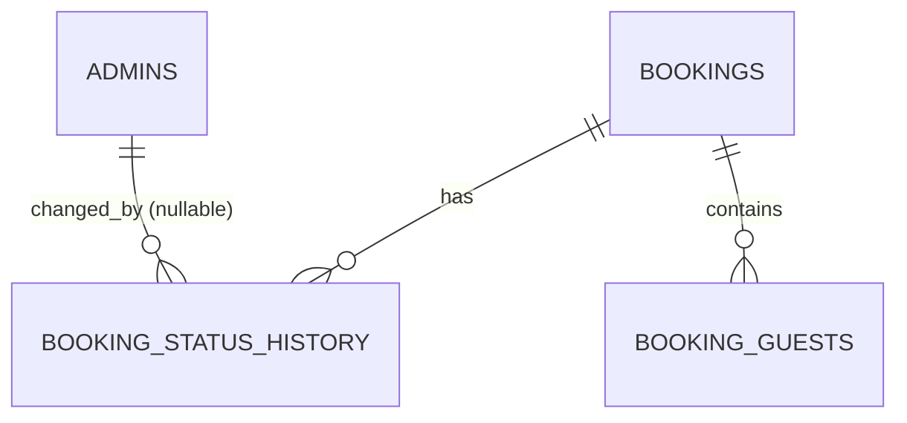

# Adatbázis- és domainmodell

**Állapot:** IMPLEMENTED jelenlegi séma + PLANNED 1.0 bővítések
**Utolsó ellenőrzött commit:** `9adc564`

Ez a dokumentum a migrációkban és a kapcsolódó PHP-kódban igazolt jelenlegi állapotot, valamint ettől szigorúan elkülönítve az 1.0 tervezett adatmodelljét írja le. A mezőleírások igazságforrásai a `database/migrations/*.sql` fájlok és a `Migrator` implementációja. Kapcsolódó témák: [architektúra](01_ARCHITECTURE.md), [publikus foglalási folyamat](03_PUBLIC_BOOKING_FLOW.md), [árképzés](05_PRICING.md), [iCal](07_ICAL_SYNC.md), [biztonság és adatvédelem](09_SECURITY.md).

## 1. Jelenlegi, megvalósított séma — IMPLEMENTED

Minden üzleti tábla InnoDB, `utf8mb4` karakterkészletű és `utf8mb4_unicode_ci` kollációjú. A foglalási napok `DATE` típusúak. A `TIMESTAMP` mezők technikai időpontok; a PHP dátumkezelés kötelező időzónája `Europe/Budapest`.

> **DECISION REQUIRED:** A repository nem tartalmaz elfogadott adatmegőrzési és törlési időket. Az alábbi „Megőrzés” értékek ezért a jelenlegi technikai viselkedést (`nincs automatikus törlés`) és a meghozandó döntést rögzítik, nem állítanak fel jogalapot vagy végleges GDPR-szabályt.

### 1.1 `admins`

**Cél:** adminisztrátori alapazonosság és jelszó-hitelesítés adatainak tárolása. Admin login persistence még nincs implementálva.

| Mező | Típus | NULL | Alapérték | Kulcs/index | Jelentés és üzleti szabály | PII | Megőrzés |
|---|---|---:|---|---|---|---:|---|
| `id` | `BIGINT UNSIGNED` | nem | auto increment | PK | Belső adminazonosító. | nem önmagában | Nincs automatikus törlés; adminéletciklus-szabály szükséges. |
| `email` | `VARCHAR(190)` | nem | nincs | UNIQUE | Bejelentkezési e-mail; adatbázis-szinten egyedi. | igen | **DECISION REQUIRED**; inaktiválás/törlés és auditigény összehangolandó. |
| `password_hash` | `VARCHAR(255)` | nem | nincs | — | Kizárólag jelszóhash tárolható, nyers jelszó nem. A hash-algoritmust a séma nem rögzíti. | bizalmas hitelesítési adat | Aktív fiókig; fiók megszűnésekor biztonságos törlési szabály szükséges. |
| `name` | `VARCHAR(120)` | nem | nincs | — | Admin megjelenítési neve. | igen | **DECISION REQUIRED**. |
| `is_active` | `BOOLEAN` | nem | `TRUE` | — | Fiók engedélyezettségi jelzője; jelenleg kód nem érvényesíti. | nem | Fiókrekorddal együtt. |
| `created_at` | `TIMESTAMP` | nem | `CURRENT_TIMESTAMP` | — | Létrehozás technikai időpontja. | közvetetten | **DECISION REQUIRED**. |
| `updated_at` | `TIMESTAMP` | nem | `CURRENT_TIMESTAMP`, módosításkor automatikusan frissül | — | Utolsó módosítás technikai időpontja. | közvetetten | **DECISION REQUIRED**. |

### 1.2 `bookings`

**Cél:** egyetlen szálláshely foglalási rekordjai, kapcsolattartói adatokkal és jelenlegi ármezőkkel.

| Mező | Típus | NULL | Alapérték | Kulcs/index | Jelentés és üzleti szabály | PII | Megőrzés |
|---|---|---:|---|---|---|---:|---|
| `id` | `BIGINT UNSIGNED` | nem | auto increment | PK | Belső foglalásazonosító. | nem önmagában | Foglalási rekorddal együtt; nincs automatikus törlés. |
| `reference` | `VARCHAR(32)` | nem | nincs | UNIQUE | Külső/belső hivatkozási kód; generálása még nincs implementálva. | közvetetten azonosíthat | **DECISION REQUIRED**. |
| `status` | `VARCHAR(32)` | nem | `'pending'` | `idx_bookings_dates_status` 3. tagja | Szabad szöveges státusz, DB `CHECK`/FK nélkül. Jelenleg csak `confirmed` blokkol; `pending` és `cancelled` nem blokkol. | nem | Foglalással együtt. |
| `arrival_date` | `DATE` | nem | nincs | `idx_bookings_dates_status` 1. tagja | Inkluzív érkezési nap. Nem lehet múltbeli az új igény domainvalidációja szerint. | közvetetten | **DECISION REQUIRED**. |
| `departure_date` | `DATE` | nem | nincs | `idx_bookings_dates_status` 2. tagja; `chk_booking_dates` | Exkluzív távozási végdátum; DB-szabály: `departure_date > arrival_date`. | közvetetten | **DECISION REQUIRED**. |
| `guest_name` | `VARCHAR(190)` | nem | nincs | — | Foglaló/vendég neve. | igen | Jogi, számviteli és GDPR-igény szerint meghatározandó. |
| `guest_email` | `VARCHAR(190)` | nem | nincs | — | Kapcsolattartási e-mail; séma nem ellenőrzi a formátumot. | igen | **DECISION REQUIRED**. |
| `guest_phone` | `VARCHAR(50)` | igen | `NULL` | — | Opcionális telefonszám. | igen | **DECISION REQUIRED**; célhoz kötött minimalizálás szükséges. |
| `adults` | `SMALLINT UNSIGNED` | nem | `1` | — | Felnőttek száma; nincs DB minimum/maximum constraint. | közvetetten | Foglalással együtt. |
| `children` | `SMALLINT UNSIGNED` | nem | `0` | — | Gyermekek száma; nincs DB maximum vagy konzisztencia-kényszer a `booking_guests` rekordokkal. | közvetetten | Foglalással együtt. |
| `total_amount` | `DECIMAL(12,2)` | nem | `0.00` | — | Jelenlegi összegmező; még nincs árkalkuláció vagy immutable snapshot. | nem | Számviteli szabályhoz igazítandó. |
| `currency` | `CHAR(3)` | nem | `'HUF'` | — | Pénznemkód; nincs ISO-listára korlátozva. | nem | Foglalással együtt. |
| `notes` | `TEXT` | igen | `NULL` | — | Szabad szöveges megjegyzés; érzékeny adat bevitelének kockázata. | potenciálisan igen | **DECISION REQUIRED**; hozzáférés, redakció és törlés szükséges. |
| `created_at` | `TIMESTAMP` | nem | `CURRENT_TIMESTAMP` | — | Létrehozás technikai időpontja. | közvetetten | Foglalással együtt. |
| `updated_at` | `TIMESTAMP` | nem | `CURRENT_TIMESTAMP`, módosításkor automatikusan frissül | — | Utolsó módosítás technikai időpontja. | közvetetten | Foglalással együtt. |

Az összetett `idx_bookings_dates_status (arrival_date, departure_date, status)` a dátum- és státuszszűrést támogatja. Az availability repository prepared statementtel a következő logikai feltételt használja: blokkoló státusz és `arrival_date < :to` és `departure_date > :from`.

### 1.3 `booking_guests`

**Cél:** a foglaláshoz tartozó egyes vendégek adatai. A publikus folyamat jelenleg nem ment ide adatot.

| Mező | Típus | NULL | Alapérték | Kulcs/index | Jelentés és üzleti szabály | PII | Megőrzés |
|---|---|---:|---|---|---|---:|---|
| `id` | `BIGINT UNSIGNED` | nem | auto increment | PK | Belső vendégrekord-azonosító. | nem önmagában | Szülő foglalással együtt. |
| `booking_id` | `BIGINT UNSIGNED` | nem | nincs | FK → `bookings.id` `ON DELETE CASCADE`; `idx_booking_guests_booking` | Kötelező szülőfoglalás; a foglalás törlése a vendégsort is törli. | közvetetten | Szülő foglalással együtt. |
| `full_name` | `VARCHAR(190)` | nem | nincs | — | Vendég teljes neve. | igen | **DECISION REQUIRED** jogi kötelezettségek alapján. |
| `date_of_birth` | `DATE` | igen | `NULL` | — | Opcionális születési dátum; a jelenlegi gyermekkor UI nem ment adatot. | igen, fokozottan érzékeny életkori adat | Adatminimalizálás vizsgálandó; lehetőleg csak szükséges kor/kategória tárolandó. |
| `created_at` | `TIMESTAMP` | nem | `CURRENT_TIMESTAMP` | — | Rekord létrehozási időpontja. | közvetetten | Vendégrekorddal együtt. |

### 1.4 `booking_status_history`

**Cél:** foglalási státuszváltozások története és adminhoz rendelése. Írási szolgáltatás még nincs.

| Mező | Típus | NULL | Alapérték | Kulcs/index | Jelentés és üzleti szabály | PII | Megőrzés |
|---|---|---:|---|---|---|---:|---|
| `id` | `BIGINT UNSIGNED` | nem | auto increment | PK | Történeti bejegyzés azonosítója. | nem önmagában | Audit-/foglalásmegőrzési szabály szükséges. |
| `booking_id` | `BIGINT UNSIGNED` | nem | nincs | FK → `bookings.id` `ON DELETE CASCADE`; `idx_status_history_booking_created` 1. tagja | Érintett foglalás; foglalástörléskor a történet is törlődik. | közvetetten | Jelenleg szülő foglalással együtt törlődik. |
| `old_status` | `VARCHAR(32)` | igen | `NULL` | — | Előző státusz; első eseménynél lehet `NULL`. Nincs státuszlista-kényszer. | nem | Történettel együtt. |
| `new_status` | `VARCHAR(32)` | nem | nincs | — | Új státusz; nincs státuszlista vagy átmeneti szabály DB-ben. | nem | Történettel együtt. |
| `changed_by_admin_id` | `BIGINT UNSIGNED` | igen | `NULL` | FK → `admins.id` `ON DELETE SET NULL` | Módosító admin; automatikus/rendszeresemény vagy törölt admin esetén `NULL`. | közvetetten | Admin törlése után az esemény megmarad, az adminhivatkozás nullázódik. |
| `note` | `VARCHAR(500)` | igen | `NULL` | — | Opcionális indok; PII bevitelének kockázata. | potenciálisan igen | **DECISION REQUIRED**; auditcél és adatminimalizálás összehangolandó. |
| `created_at` | `TIMESTAMP` | nem | `CURRENT_TIMESTAMP` | `idx_status_history_booking_created` 2. tagja | Változás rögzítési időpontja. | közvetetten | Auditmegőrzési szabály szükséges. |

### 1.5 `pricing_rules`

**Cél:** dátumtartományhoz rendelt alap éjszakánkénti ár és minimum tartózkodás. A tábla jelenleg nincs bekötve árkalkulációba.

| Mező | Típus | NULL | Alapérték | Kulcs/index | Jelentés és üzleti szabály | PII | Megőrzés |
|---|---|---:|---|---|---|---:|---|
| `id` | `BIGINT UNSIGNED` | nem | auto increment | PK | Árszabály azonosítója. | nem | **DECISION REQUIRED**; történeti árhoz verziózás/snapshot kell. |
| `name` | `VARCHAR(190)` | nem | nincs | — | Adminisztratív megnevezés. | nem, ha rendeltetésszerű | Szabállyal együtt. |
| `valid_from` | `DATE` | nem | nincs | — | Inkluzív kezdőnap. | nem | Történeti elszámolási igény szerint. |
| `valid_until` | `DATE` | nem | nincs | `chk_pricing_rule_dates` | Exkluzív végdátum; `valid_until > valid_from`. | nem | Történeti elszámolási igény szerint. |
| `nightly_price` | `DECIMAL(12,2)` | nem | nincs | — | Egy éjszaka ára; nincs nemnegatív constraint és nincs itt pénznem. | nem | Történeti elszámolási igény szerint. |
| `minimum_nights` | `SMALLINT UNSIGNED` | nem | `1` | — | Szabályhoz tartozó minimum éjszaka; nincs pozitív `CHECK`. | nem | Szabállyal együtt. |
| `priority` | `INT` | nem | `0` | — | Ütköző szabályok sorrendjének előkészítése; kiválasztási algoritmus nincs. | nem | Szabállyal együtt. |
| `is_active` | `BOOLEAN` | nem | `TRUE` | — | Aktivitási jelző. | nem | Inaktivált szabály megőrzése még eldöntendő. |
| `created_at` | `TIMESTAMP` | nem | `CURRENT_TIMESTAMP` | — | Létrehozás időpontja. | nem | Szabállyal együtt. |
| `updated_at` | `TIMESTAMP` | nem | `CURRENT_TIMESTAMP`, módosításkor automatikusan frissül | — | Utolsó módosítás időpontja. | nem | Szabállyal együtt. |

### 1.6 `blocked_periods`

**Cél:** adminisztratív vagy műszaki okból nem foglalható fél-nyitott időszakok.

| Mező | Típus | NULL | Alapérték | Kulcs/index | Jelentés és üzleti szabály | PII | Megőrzés |
|---|---|---:|---|---|---|---:|---|
| `id` | `BIGINT UNSIGNED` | nem | auto increment | PK | Blokkolás azonosítója. | nem | **DECISION REQUIRED**; lejárt blokkolások archiválása/törlése. |
| `start_date` | `DATE` | nem | nincs | `idx_blocked_period_dates` 1. tagja | Inkluzív kezdőnap. | nem | Blokkolási rekorddal együtt. |
| `end_date` | `DATE` | nem | nincs | `idx_blocked_period_dates` 2. tagja; `chk_blocked_period_dates` | Exkluzív végdátum; `end_date > start_date`. | nem | Blokkolási rekorddal együtt. |
| `reason` | `VARCHAR(500)` | igen | `NULL` | — | Opcionális indok; személynév vagy érzékeny adat nem írható bele. | potenciálisan igen | Minimalizálandó; végleges időtartam eldöntendő. |
| `created_at` | `TIMESTAMP` | nem | `CURRENT_TIMESTAMP` | — | Létrehozás időpontja. | közvetetten | Blokkolási rekorddal együtt. |

A repository minden `blocked_periods` rekordot blokkolónak tekint, ha `start_date < :to` és `end_date > :from`. Nincs aktív/inaktív jelző és nincs forrástípus.

### 1.7 `settings`

**Cél:** általános kulcs–érték konfiguráció előkészítése. Jelenleg nincs alkalmazási olvasó/író implementáció.

| Mező | Típus | NULL | Alapérték | Kulcs/index | Jelentés és üzleti szabály | PII | Megőrzés |
|---|---|---:|---|---|---|---:|---|
| `setting_key` | `VARCHAR(190)` | nem | nincs | PK | Egyedi beállításkulcs. | nem | Aktuális konfigurációig; változástörténet nincs. |
| `setting_value` | `TEXT` | igen | `NULL` | — | Típus nélküli érték. Secret vagy szükségtelen PII nem tárolható benne; validáció nincs. | potenciálisan igen | Kulcsonként meghatározandó. |
| `updated_at` | `TIMESTAMP` | nem | `CURRENT_TIMESTAMP`, módosításkor automatikusan frissül | — | Utolsó módosítás időpontja. | közvetetten | Rekorddal együtt. |

### 1.8 `migrations` — futásidőben létrehozott technikai tábla

**Cél:** a sikeresen lefuttatott SQL-migrációfájlok nyilvántartása. Nem külön SQL-migráció, hanem a `Migrator::migrate()` `CREATE TABLE IF NOT EXISTS` utasítása hozza létre.

| Mező | Típus | NULL | Alapérték | Kulcs/index | Jelentés és üzleti szabály | PII | Megőrzés |
|---|---|---:|---|---|---|---:|---|
| `version` | `VARCHAR(255)` | nem | nincs | PK | A migráció fájlneve, például `001_create_admins.sql`; sikeres DDL után kerül be. | nem | Az adatbázis teljes élettartamáig. |
| `executed_at` | `TIMESTAMP` | nem | `CURRENT_TIMESTAMP` | — | Alkalmazás időpontja. | nem | Az adatbázis teljes élettartamáig. |

> **Ellentmondás:** a dokumentációs feladat `schema_migrations` táblát nevez meg, a tényleges kód azonban `migrations` nevű táblát hoz létre és kérdez. A jelenlegi igazságforrás ezért `migrations`. Átnevezés kizárólag külön, verziózott és visszafelé kompatibilitást kezelő migrációval történhet; ebben a dokumentációs sprintben nincs sémamódosítás.

A migrátor lexikografikusan rendezi a `*.sql` fájlokat, csak a még nem rögzített fájlokat futtatja, és sikeres végrehajtás után rögzíti a fájlnevet. MySQL DDL implicit commitja miatt egy migráció nem garantáltan teljesen atomi; rollback és checksum/utólagos fájlmódosítás-észlelés nincs.

## 2. Kapcsolatok — IMPLEMENTED



Szövegesen: egy foglaláshoz nulla vagy több vendég és státusztörténeti sor tartozhat. A vendégek és a státusztörténet foglalástörléskor kaszkádosan törlődnek. Egy státuszesemény opcionálisan egy adminhoz tartozik; admin törlésekor a hivatkozás `NULL` lesz. A `pricing_rules`, `blocked_periods`, `settings` és `migrations` jelenleg önálló táblák.

## 3. Fél-nyitott dátumintervallum — IMPLEMENTED

A foglalás intervalluma `[arrival_date, departure_date)`: az érkezési nap benne van, a távozási nap nincs benne a foglalt éjszakákban. Az éjszakák száma `departure_date - arrival_date` naptári napokban. Példa: `[2026-08-10, 2026-08-12)` a 10-i és 11-i éjszakát foglalja; 12-én új vendég érkezhet.

Két intervallum pontos átfedési képlete:

```text
left.arrival < right.departure AND left.departure > right.arrival
```

SQL-lekérdezésben egy `[from, to)` tartománnyal való átfedés:

```sql
arrival_date < :to_date AND departure_date > :from_date
```

Ezért `[2026-08-10, 2026-08-12)` és `[2026-08-12, 2026-08-15)` nem ütközik; azonos érkezési nap, illetve egy másik intervallum által közrefogott időszak ütközik. A `BookingPeriod` invariánsai: távozás szigorúan későbbi az érkezésnél, és mindkét `DateTimeImmutable` éjfélre normalizált. Az `AvailabilityService` az érkezés múltbeliségét külön utasíthatja el Budapest szerinti „ma” alapján.

## 4. Napállapotok — IMPLEMENTED

| Állapot | Jelentés | Érkezés választható | Távozás választható |
|---|---|---:|---:|
| `available` | Nincs blokkolás vagy blokkoló foglalás. | igen | igen |
| `occupied` | Blokkoló foglalás belső foglalt éjszakája. | nem | nem |
| `arrival_only` | Egy blokkoló foglalás érkezési napja. | nem | igen |
| `departure_only` | Egy blokkoló foglalás távozási napja. | igen | igen |
| `turnover` | Ugyanezen a napon egy foglalás távozik és másik érkezik. | nem | igen |
| `blocked` | A nap adminisztratív blokkolt időszakba esik. | nem | nem |
| `past` | A Budapest szerinti mai napnál korábbi. | nem | nem |

Kiértékelési elsőbbség: `past`, majd `blocked`, majd a foglalási jelzők (`turnover`, `arrival_only`, `departure_only`, `occupied`), végül `available`. Emiatt egy blokkolt nap nem kap fél napos foglalási állapotot akkor sem, ha foglalási határnap is.

## 5. Foglalási státuszok és invariánsok — IMPLEMENTED

- Az adatbázis `VARCHAR(32)` mezőt használ, tehát nincs zárt státusz-enum és nincs DB-szintű állapotgép.
- Az egyetlen alapérték `pending`.
- A jelenlegi `config/booking.php` szerint kizárólag `confirmed` blokkolja az elérhetőséget.
- A tesztek és repository-viselkedés szerint `pending` és `cancelled` nem blokkol.
- Ismeretlen státusz technikailag menthető, de nem blokkol, amíg nincs a `blocking_statuses` listában.
- A státuszváltások megengedett sorrendje, jogosultsága és atomi történetírása még nincs implementálva.

> **DECISION REQUIRED:** Az 1.0 zárt státuszkészlete, átmeneti mátrixa, a `pending` ideiglenes tartási ideje és az iCal-exportba bevont státuszok tulajdonosi döntést igényelnek. A double booking elleni védelemhez a mentés pillanatában tranzakciós újraellenőrzés szükséges; a jelenlegi read-only availability ellenőrzés önmagában nem foglalási zár.

## 6. Adatvédelem és megőrzés — jelenlegi helyzet

**IMPLEMENTED:** A séma elkülöníti a fő foglalást, vendégeket és történetet; FK-k szabályozzák a kapcsolt törlést. A repository availability lekérdezése csak dátumokat olvas, így a publikus API nem kap vendég-PII-t.

**Hiányzó kontrollok / DECISION REQUIRED:**

- nincs rögzített jogalap, megőrzési idő, anonimizálási vagy törlési workflow;
- a `bookings` törlése kaszkádosan eltávolítja a vendég- és státusztörténetet, ami audit- vagy jogi megőrzéssel ütközhet;
- a szabad szöveges `notes`, `note`, `reason` és `setting_value` PII-t vagy titkot tartalmazhat;
- nincs mezőszintű titkosítás, hozzáférési napló vagy soft delete;
- a születési dátum tárolásának szükségességét adatminimalizálási vizsgálattal kell igazolni;
- backupok megőrzése és törlési kérelmek backupokra gyakorolt kezelése nincs definiálva.

Elfogadási feltétel a megőrzési szabályhoz: minden PII-mezőhöz legyen dokumentált cél, jogalap, hozzáférési kör, aktív adatbázis- és backup-megőrzési idő, valamint ellenőrizhető törlési vagy anonimizálási eljárás.

## 7. Tervezett 1.0 sémabővítések — PLANNED, NEM MIGRÁLT

Az alábbiak logikai modellek. Nem léteznek a jelenlegi adatbázisban; pontos oszlopok, adattípusok, indexek, FK-k és retention csak külön tervezés és verziózott migráció után tekinthetők véglegesnek.

### 7.1 Admin hitelesítés és audit

- `admin_login_codes`: admin FK, kizárólag hash-elt egyszer használatos kód, lejárat, próbálkozásszám, felhasználás/visszavonás időpontja és újraküldési metaadat. Nyers 2FA-kód nem tárolható. **Elfogadás:** 10 perces lejárat és legfeljebb 5 próbálkozás atomi módon kikényszerített, kód nem olvasható vissza.
- `admin_sessions`: admin FK, hash-elt session token/azonosító, létrehozás, utolsó aktivitás, lejárat, visszavonás, minimális kliensmetaadat. **Elfogadás:** session rotation után a régi session érvénytelen, logout és adminletiltás visszavonja az érintett sessionöket.
- `audit_logs`: actor admin (nullable rendszereseménynél), eseménytípus, cél entitástípus/-azonosító, időpont, strukturált változásmetaadat PII-minimalizálással. **Elfogadás:** adminbiztonsági és adatváltoztató műveletek append-only módon kereshetők; secret, jelszóhash, 2FA-kód és teljes session token nem kerül bele.

Részletes auth- és threat-model: [admin és hitelesítés](04_ADMIN_AND_AUTHENTICATION.md), [biztonság](09_SECURITY.md).

### 7.2 Árazási felülírások és pillanatképek

- Tervezett pricing override modell a szezonális, hétvégi, dátumspecifikus, fix díj-, kedvezmény- és adminfelülírások prioritásos kezelésére.
- Tervezett booking pricing snapshot a foglaláskor alkalmazott bemenetek, szabályverziók, tételes összegek, adók/díjak, kerekítés, végösszeg és pénznem változtathatatlan rögzítésére.
- **Elfogadás:** egy meglévő foglalás történeti ára későbbi árszabály-módosítástól nem változik; manuális felülírás indoka és adminja auditált; HUF kerekítés determinisztikus.

A konkrét táblahatárok és üzleti értékek **DECISION REQUIRED** státuszúak; lásd [árképzés](05_PRICING.md).

### 7.3 E-mail sablonok és naplók

- `email_templates`: stabil sablonazonosító, tárgy, HTML és plain-text tartalom, nyelv/verzió, aktivitás.
- `email_logs`: esemény és címzett minimalizált referenciája, idempotenciakulcs, sablonverzió, állapot, próbálkozásszám, időpontok és redaktált hiba; üzenettörzs és SMTP-credential nem naplózható szükségtelenül.
- **Elfogadás:** ugyanaz az idempotenciakulcs nem küldhető kétszer; retry állapot követhető; a napló nem tartalmaz secretet és retentionje dokumentált.

Lásd [e-mail folyamatok](06_EMAIL_WORKFLOWS.md).

### 7.4 iCal források, események és naplók

- `ical_sources`: forrásazonosító, név, biztonságosan kezelt URL/token referencia, aktív állapot, utolsó siker/hiba és szinkronbeállítások.
- `ical_events`: forrás FK, külső `UID`, `SEQUENCE`, egész napos inkluzív `DTSTART` és exkluzív `DTEND`, `STATUS`, raw hash, `last_seen_at`, törölt/eltűnt jelző és belső eredetjelző a loop preventionhöz.
- `ical_sync_logs`: futásazonosító, forrás, kezdés/befejezés, eredmény, darabszámok és redaktált hiba.
- **Elfogadás:** `(source_id, UID)` egyedi; ismételt import idempotens; `SEQUENCE`/hash változás követett; `CANCELLED` és eltűnt esemény nem törlődik nyom nélkül; feed token és külső URL nem szivárog publikus naplóba; külső esemény elkülönül a belső foglalástól.

Lásd [iCal szinkron](07_ICAL_SYNC.md).

## 8. Tervezett sémamódosítások általános elfogadási feltételei

Minden fenti PLANNED elemhez teljesülnie kell:

1. új, verziózott migráció és visszaállítási/üzemeltetési terv készül;
2. `DATE` marad minden foglalási naptári határ, a fél-nyitott modell nem sérül;
3. FK, egyediség, szükséges `CHECK` és lekérdezési index dokumentált és tesztelt;
4. minden értéket tartalmazó SQL PDO prepared statementet használ;
5. migráció előtt kompatibilitási és meglévőadat-konverziós terv készül;
6. PII-cél, hozzáférés és retention mezőnként dokumentált;
7. üzleti invariant unit/integration tesztet, kritikus konkurens írás tranzakciós tesztet kap;
8. a jelenlegi és tervezett állapot ugyanabban a pull requestben frissül ebben a dokumentumban.

## 9. Ismert adatmodell-kockázatok

- A státusz szabad szöveg, így hibás érték és meg nem engedett átmenet tárolható.
- Nincs adatbázis-szintű védelem két átfedő `confirmed` foglalás ellen; az alkalmazási tranzakció és konkurenciakezelés még hiányzik.
- Az összetett booking index mezősorrendjének hatékonyságát valós adatmennyiségen `EXPLAIN`-nel kell ellenőrizni.
- Az `admins.email` egyedisége az aktuális kollációtól függ; normalizálási szabály nincs dokumentálva.
- A `pricing_rules` átfedhet, negatív ár is bekerülhet, a prioritási döntés nincs implementálva.
- A `settings` típus nélküli, validálatlan tároló; secret-tárolásra nem alkalmas.
- A migrációknak nincs checksumja, rollbackje vagy teljes DDL-atomicitása.
- A `TIMESTAMP` session timezone és cPanel/MySQL környezet konzisztenciája üzemeltetési ellenőrzést igényel; a foglalási napok ettől függetlenül `DATE` értékek.
