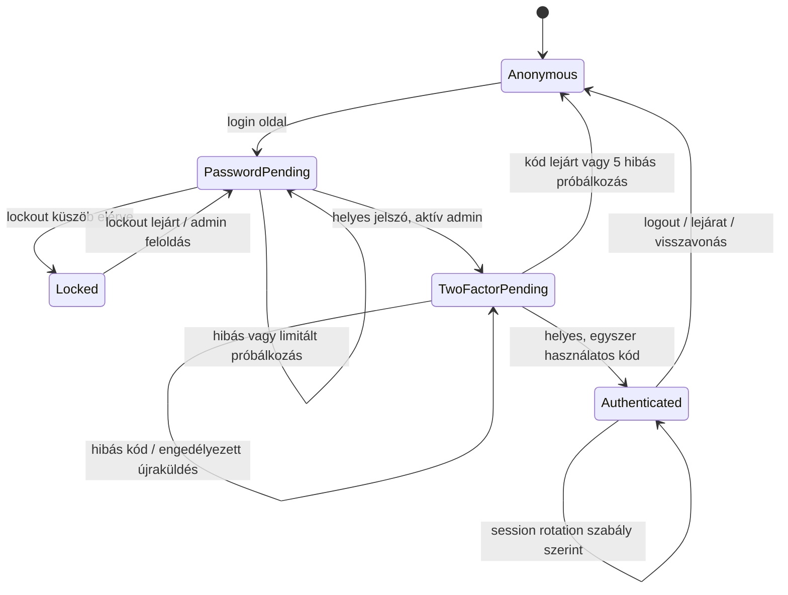

# Adminfelület és hitelesítés

**Állapot:** az admin login JSON placeholder IMPLEMENTED; minden tényleges admin- és hitelesítési funkció PLANNED
**Utolsó ellenőrzött commit:** `9adc564`

## Jelenlegi állapot

**IMPLEMENTED:** a `GET /admin/login` útvonal autentikáció nélkül, `200 OK` válasszal kizárólag ezt a JSON objektumot adja: `{"message":"Admin login endpoint placeholder"}`. A route-ot a front controller regisztrálja, a választ a `HomeController::adminLogin()` állítja elő. Ez nem bejelentkezési felület és nem hitelesítési API.

**IMPLEMENTED:** az `admins` tábla tárolja az `email`, `password_hash`, `name`, `is_active` és időbélyeg mezőket. A séma önmagában nem jelent működő autentikációt; részletei az [adatbázis- és domainmodellben](02_DATABASE_AND_DOMAIN_MODEL.md) találhatók.

**PLANNED:** jelenleg nincs jelszóellenőrzés, 2FA-kód, admin session, logout, CSRF-védelem, rate limit, lockout, audit log, jogosultságkezelés vagy admin UI. A kapcsolódó tervezett API-kat az [API-referencia](08_API_REFERENCE.md), a kontrollokat a [biztonsági specifikáció](09_SECURITY.md) írja le.

## Szerepkör és jogosultsági modell

**PLANNED:** az 1.0 egyetlen `admin` szerepkört használ. Minden adminművelet aktív, teljesen hitelesített sessiont igényel; a jelszófázist teljesítő, de 2FA-ra váró állapot nem ad üzleti adathoz hozzáférést. Minden objektumhoz szerveroldali jogosultságvizsgálat tartozik, a kliensoldali menü elrejtése nem kontroll.

> **DECISION REQUIRED:** szükséges-e 1.0-ban külön read-only operátor vagy több jogosultsági szint. Ennek hiányában az egyetlen adminszerepkör elve érvényes.

## Tervezett adminmodulok

| Modul | Állapot | Követelmény | Elfogadási feltétel |
|---|---|---|---|
| Login | PLANNED | E-mail + jelszó, majd kötelező e-mailes 2FA | Helyes jelszó önmagában nem nyit adminoldalt; hibák nem fedik fel a fiók létét. |
| Dashboard | PLANNED | Közelgő érkezések/távozások, nyitott feladatok, rendszerállapot | Csak teljes sessionnel érhető el; összesítések egyeznek az adatbázissal. |
| Foglaláslista | PLANNED | Lapozás, szűrés, rendezés | Minden paraméter validált; PII csak hitelesített adminnak jelenik meg. |
| Foglalás részlete | PLANNED | Vendégek, státusztörténet, ár- és kommunikációs adatok | Nem létező és nem engedélyezett rekord biztonságos választ ad; megtekintés auditálható. |
| Státuszkezelés | PLANNED | Csak engedélyezett átmenetek | Tiltott átmenet nem módosít adatot; siker esetén status history és audit rekord készül. |
| Kézi foglalás | PLANNED | Admin által bevitt foglalás | Mentés tranzakcióban újraellenőrzi az átfedést; kettős foglalás nem jöhet létre. |
| Blokkolt időszak | PLANNED | Létrehozás, módosítás, feloldás | Fél-nyitott dátumintervallum és indok kötelező; változás auditált. |
| Pricing | PLANNED | Szabályok és felülírások kezelése | Jogosultság, validáció, verziózás/audit; korábbi ár-pillanatkép nem változik. |
| E-mail napló | PLANNED | Küldési állapot, hiba, biztonságos újraküldés | Levéltörzs és titok nem kerül általános logba; újraküldés idempotens és auditált. |
| iCal | PLANNED | Források, státusz, kézi sync és konfliktusok | Token maszkolt; SSRF-védelem; kézi futtatás auditált. |
| Settings | PLANNED | Validált alkalmazásbeállítások | Ismeretlen kulcs nem írható; érzékeny érték nem jelenik meg visszaolvashatóan. |
| Audit log | PLANNED | Kereshető, csak hozzáfűzhető eseménynapló | Ki, mikor, mit, mely objektumon és milyen eredménnyel tett; secret és szükségtelen PII nélkül. |

## Bejelentkezési állapotgép

**PLANNED:** minden dátum/idő `Europe/Budapest` alkalmazási időzónában értelmezendő; a biztonsági időpontok adatbázisbeli reprezentációját a migráció tervezésekor egységesíteni kell.

Szövegesen: anonim állapotban nincs adminjog. Helyes e-mail és jelszó után is csak korlátozott 2FA-challenge jön létre. A hatjegyű kód egyszer használható, 10 percig érvényes és legfeljebb 5 ellenőrzési próbálkozást enged. Csak sikeres kódellenőrzés után, új session-azonosítóval jön létre hitelesített session. Logout, idle/abszolút lejárat, fiók letiltása vagy adminisztratív visszavonás után újra anonim az állapot.

### 1. Jelszófázis

**PLANNED:** az e-mail normalizálása dokumentált, konzisztens módon történik; az input hosszkorlátos. A szerver az aktív admin `password_hash` értékét `password_verify()` segítségével ellenőrzi, és sikeres újrahash-igényt `password_needs_rehash()` alapján kezel. Ismeretlen, inaktív és hibás jelszavú fiók kifelé azonos általános hibát és közel azonos feldolgozási profilt kap.

Sikerkor a rendszer:

1. nem hoz létre teljes jogosultságú sessiont;
2. kriptográfiailag biztonságos, hatjegyű egyszer használatos kódot generál;
3. csak a kód erős hashét, lejáratát, próbálkozásszámát és challenge-azonosítóját tárolja;
4. az e-mailt az [e-mail folyamat](06_EMAIL_WORKFLOWS.md) absztrakcióján keresztül küldi, közvetlen `mail()` nélkül;
5. általános választ ad, amely nem árulja el a fiók létezését.

### 2. E-mailes 2FA

**PLANNED:** a kód pontosan hat számjegy, 10 perc után lejár, egyszer használható, és challenge-enként maximum 5 hibás ellenőrzés engedett. Új kód kiadása érvényteleníti az előzőt. A verify és resend végpont IP-, fiók- és challenge-alapú rate limitet kap. A kód nem kerül URL-be, cookie-ba, logba vagy e-mail tárgysorba.

> **DECISION REQUIRED:** az újraküldés minimum várakozási ideje, óránkénti maximuma, a jelszópróbák küszöbe/ablaka, valamint a lockout hossza még véglegesítendő. A kontrollt ezen értékek lezárása nélkül nem szabad implementációs részletként rögzíteni.

**DEFERRED:** TOTP támogatás. A challenge és faktor modell legyen bővíthető `email_code` mellett későbbi `totp` típussal, de TOTP nem 1.0 elfogadási feltétel.

### 3. Session és cookie

**PLANNED:** sikeres 2FA után a session ID kötelezően rotálódik; a jelszó előtti anonim és a 2FA köztes session nem emelhető változatlan azonosítóval. A cookie `Secure`, `HttpOnly` és megfelelő `SameSite` attribútumot kap, domain/path hatóköre minimális. Session ID nem kerül URL-be. A szerveroldali session tartalmazza az admin azonosítóját, auth szintjét, létrehozási, utolsó aktivitási, abszolút lejárati és visszavonási adatát.

> **DECISION REQUIRED:** az idle és abszolút session-élettartam. Érzékeny műveleteknél rövid idejű friss hitelesítés megkövetelése külön döntendő el.

### 4. Logout és visszavonás

**PLANNED:** a logout állapotváltoztató POST kérés CSRF-tokennel. A szerver visszavonja a sessiont, törli a cookie-t ugyanazzal a path/domain beállítással, és audit eseményt ír. Jelszóváltozás, admin letiltása és biztonsági incidens minden aktív session visszavonását támogatja.

## Hibafolyamatok

| Helyzet | Külső viselkedés | Belső művelet | Audit/megfigyelés |
|---|---|---|---|
| Hiányzó/hibás input | Általános validációs hiba, secret visszatükrözése nélkül | Nincs auth állapotváltás | Aggregált validációs metrika; jelszó/kód nincs logban |
| Ismeretlen e-mail / hibás jelszó / inaktív admin | Azonos `Invalid credentials` jellegű válasz | Sikertelen számláló és rate limit | Eredmény és pszeudonimizált cél; fiók-enumeráció nélkül |
| Jelszó rate limit | Általános, későbbi próbát kérő válasz | Kérés elutasítása jelszóellenőrzés előtt vagy után konzisztensen | Riasztás küszöb felett |
| Fiók lockout | Nem fedi fel külön a fiók állapotát | Új challenge nem készül | Lockout és feloldás auditált |
| 2FA e-mail átmeneti hibája | Nem jön létre teljes session; biztonságos újrapróba | Challenge állapota `delivery_failed` vagy újraküldhető | Transport hiba secret/PII nélkül |
| Hibás 2FA-kód | Általános hiba és hátralévő próbák felfedése nélkül | Atomi próbálkozásszám-növelés | Sikertelen verify esemény |
| Lejárt kód | Új challenge indítását/engedett resend-et kér | Régi kód nem használható | Lejárati esemény |
| Ötödik hibás kód | Challenge lezárása; új jelszavas belépés szükséges | Kód végleg érvénytelen | Magas kockázatú audit esemény |
| Túl korai/túl sok resend | `429` és biztonságos retry jelzés | Új kód nem készül | Limit-esemény |
| Kód párhuzamos felhasználása | Pontosan egy kérés lehet sikeres | Atomi felhasználásjelölés/tranzakció | Többszörös felhasználási kísérlet |
| Lejárt/visszavont session | Általános `401`, loginra irányítás UI-ban | Cookie törlése, nincs művelet | Ok kategóriája naplózható |
| Hiányzó/hibás CSRF | `403`, állapotváltozás nélkül | Tranzakció nem indul vagy rollback | CSRF-esemény, token nélkül |
| Nincs jogosultság | `403`; objektumlétezés nem szivároghat | Nincs üzleti módosítás | Admin, művelet, cél és eredmény auditált |
| Belső/DB/SMTP hiba | Általános hiba és korrelációs azonosító | Fail closed; részleges auth/session nem marad | Stack trace csak védett szerverlogban |

## CSRF, session rotation, rate limit és audit minimum

**PLANNED:** minden állapotváltoztató admin kérés szerveroldali, sessionhöz kötött, egyszer használat után rotálható CSRF-tokent ellenőriz. Origin/Referer ellenőrzés védelmi mélység, nem a token helyettesítője. Login, verify és resend külön rate-limit bucketet kap IP és fiókcél szerint. A számlálók frissítése atomi; proxy mögött csak megbízható proxy által beállított kliens IP fogadható el.

Az audit log minimum mezői: eseménytípus, időpont, admin azonosító ha ismert, cél objektumtípus és azonosító, eredmény, korrelációs azonosító, biztonságosan kezelt kliens IP és user agent. Jelszó, 2FA-kód, session ID, CSRF-token, iCal-token és teljes e-mail-tartalom soha nem naplózható. Az audit bejegyzés alkalmazási úton nem módosítható vagy törölhető.

## cPanel-kompatibilis kialakítás

**PLANNED:** a megoldás PHP 8.2+, MySQL és Composer production artifact mellett működik; Node.js nem runtime-függőség. A `public/` marad az egyetlen document root. Session tárolás nem hagyatkozhat ellenőrizetlenül megosztott hosting alapértelmezésre; a választott szerveroldali tároló, takarító cron és fájljogosultság dokumentálandó. SMTP hitelesítő adatok és app secret a webrooton kívüli környezeti konfigurációban maradnak.

## Modul elfogadási feltételei

Az admin/auth sprint csak akkor fogadható el, ha:

1. az összes admin route teljes 2FA session nélkül elutasít, kivéve a dokumentált login/verify/resend végpontokat;
2. helyes jelszó után sincs adminjog a 2FA sikeréig;
3. a 10 perces, hatjegyű kód legfeljebb 5 próbával, egyszer használhatóan és atomi módon működik;
4. session fixation teszt igazolja a rotációt jelszó- és 2FA-határon;
5. cookie attribútumok HTTPS stagingen ellenőrzöttek;
6. logout és admin letiltás ténylegesen visszavonja a sessiont;
7. CSRF, rate limit, lockout, credential enumeration és párhuzamos kódhasználat automatizált tesztet kap;
8. minden admin üzleti módosítás auditált, a log nem tartalmaz secretet;
9. az új táblák verziózott migrációban készülnek, rollback/restore tervvel;
10. az API-, biztonsági, e-mail- és üzemeltetési dokumentáció ugyanabban a PR-ban frissül.

## Kapcsolódó dokumentumok

- [Adatbázis- és domainmodell](02_DATABASE_AND_DOMAIN_MODEL.md)
- [E-mail folyamatok](06_EMAIL_WORKFLOWS.md)
- [API-referencia](08_API_REFERENCE.md)
- [Biztonság](09_SECURITY.md)
- [Tesztelés és üzemeltetés](10_TESTING_AND_OPERATIONS.md)
- [Roadmap és döntések](11_ROADMAP_AND_DECISIONS.md)
