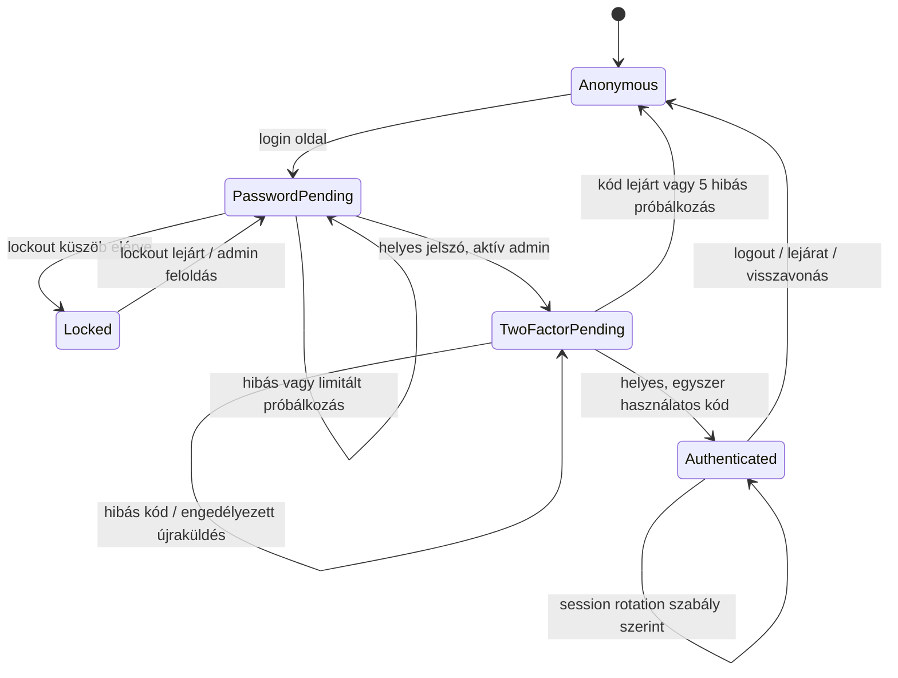

# Adminfelület és hitelesítés

**Állapot:** auth, booking management, pricing és iCal adminfelület IMPLEMENTED; kézi booking, settings és kereshető audit UI PLANNED
**Utolsó ellenőrzés:** 2026-07-18, `release/rc1` munkafa (commit előtt)

## Jelenlegi állapot

### Sprint 3 implementációs leltár

**IMPLEMENTED:** általános kimenetű jelszóellenőrzés aktív adminra, dummy-hash időzítéskiegyenlítéssel; `password_verify()` és szükség esetén rehash. Az e-mail normalizált.

**IMPLEMENTED:** kriptográfiailag generált hatjegyű e-mailes 2FA, hash-elt tárolás, 10 perces TTL, maximum öt hibás próbálkozás, egyszer használhatóság és 60 másodperces resend-várakozás. A kódot a mailer kapja meg, adatbázisba és audit metadata-ba nem kerül plaintextként.

**IMPLEMENTED:** pending és authenticated sessionállapot, rotáció a biztonsági határokon, 15 perces csúszó idle timeout, konfigurálható abszolút session-élettartam, logout és szerveroldali visszavonás; sessionhöz kötött CSRF minden admin POST controllerben; konfigurálható login/2FA rate limit és szigorúan szűrt audit események.

**IMPLEMENTED UI:** login-, 2FA-, dashboard-, logout-, booking lista/részlet/státusz-, blocked-period-, pricing- és iCal-controller, szerveroldali sablonok, A Bata design (`#19194B`, `#F0A236`, `#FFFFFF`). Kézi booking, általános settings és kereshető auditnapló UI nincs.

**IMPLEMENTED HTTP-integráció:** a front controller beköti a login, 2FA verify/resend, dashboard és logout route-okat. A release-kapuhoz Docker/Mailpit smoke továbbra is szükséges.

**IMPLEMENTED:** az abszolút session maximumot az `ADMIN_SESSION_ABSOLUTE_TIMEOUT_SECONDS` adja meg. Productionben kötelező és a 15 perces idle timeoutnál nagyobb pozitív egész; fejlesztésben a dokumentált alapérték 28 800 másodperc. A rate-limit küszöbök konfigurálható fejlesztési alapértékek, véglegesítésük nyitott.

**IMPLEMENTED:** a korábbi JSON placeholdert a Sprint 3 HTML login controller és sablon váltotta fel.

**IMPLEMENTED:** az `admins` tábla tárolja az `email`, `password_hash`, `name`, `is_active` és időbélyeg mezőket. A séma önmagában nem jelent működő autentikációt; részletei az [adatbázis- és domainmodellben](02_DATABASE_AND_DOMAIN_MODEL.md) találhatók.

**IMPLEMENTED:** jelszóellenőrzés, 2FA-kód, admin session, logout, CSRF-védelem, rate limit/lockout persistence, audit log port/adapter és a fent felsorolt üzleti adminmodulok. **PLANNED:** kézi booking, settings, kereshető audit UI és esetleges részletesebb jogosultsági modell.

## Szerepkör és jogosultsági modell

**IMPLEMENTED:** az 1.0 egyetlen `admin` szerepkört használ. Minden implementált adminművelet aktív, teljesen hitelesített sessiont igényel; a jelszófázist teljesítő, de 2FA-ra váró állapot nem ad üzleti adathoz hozzáférést. A kliensoldali menü elrejtése nem jogosultsági kontroll.

> **DECISION REQUIRED:** szükséges-e 1.0-ban külön read-only operátor vagy több jogosultsági szint. Ennek hiányában az egyetlen adminszerepkör elve érvényes.

## Tervezett adminmodulok

| Modul | Állapot | Követelmény | Elfogadási feltétel |
|---|---|---|---|
| Login | IMPLEMENTED | E-mail + jelszó, majd kötelező e-mailes 2FA | Helyes jelszó önmagában nem nyit adminoldalt; hibák nem fedik fel a fiók létét. |
| Dashboard | IMPLEMENTED alap | Minimális védett céloldal; üzleti összesítések még nincsenek | Csak teljes sessionnel érhető el. |
| Foglaláslista | IMPLEMENTED | Lapozás, keresés és szűrés | Minden paraméter validált; PII csak hitelesített adminnak jelenik meg. |
| Foglalás részlete | IMPLEMENTED | Vendég-, státusz-, ár-, policy-, audit- és e-mail adatok | Nem létező rekord biztonságos választ ad. |
| Státuszkezelés | IMPLEMENTED | Csak engedélyezett átmenetek | Tiltott átmenet nem módosít adatot; siker esetén status history és audit rekord készül. |
| Kézi foglalás | PLANNED | Admin által bevitt foglalás | Mentés tranzakcióban újraellenőrzi az átfedést; kettős foglalás nem jöhet létre. |
| Blokkolt időszak | IMPLEMENTED | Létrehozás és soft-delete feloldás | Fél-nyitott dátumintervallum és indok kötelező; változás auditált. |
| Pricing | IMPLEMENTED | Szabály CRUD/aktiválás és preview | Jogosultság, validáció és audit; korábbi ár-pillanatkép nem változik. |
| E-mail állapot | IMPLEMENTED részhalmaz | Booking részleten státusz és failed státuszlevél újraküldés | Levéltörzs és titok nem kerül általános logba; újraküldés auditált. |
| iCal | IMPLEMENTED | Források, státusz, kézi sync, log és exporttoken | Token maszkolt; SSRF-védelem; kézi futtatás auditált. |
| Settings | PLANNED | Validált alkalmazásbeállítások | Ismeretlen kulcs nem írható; érzékeny érték nem jelenik meg visszaolvashatóan. |
| Audit log | PLANNED | Kereshető, csak hozzáfűzhető eseménynapló | Ki, mikor, mit, mely objektumon és milyen eredménnyel tett; secret és szükségtelen PII nélkül. |

## Bejelentkezési állapotgép

**IMPLEMENTED:** minden üzleti dátum/idő `Europe/Budapest` alkalmazási időzónában értelmezendő; a session és 2FA időpontokat a persistence réteg konzisztensen kezeli.

```mermaid
stateDiagram-v2
    [*] --> Anonymous
    Anonymous --> PasswordPending: login oldal
    PasswordPending --> PasswordPending: hibás vagy limitált próbálkozás
    PasswordPending --> Locked: lockout küszöb elérve
    Locked --> PasswordPending: lockout lejárt / admin feloldás
    PasswordPending --> TwoFactorPending: helyes jelszó, aktív admin
    TwoFactorPending --> TwoFactorPending: hibás kód / engedélyezett újraküldés
    TwoFactorPending --> Anonymous: kód lejárt vagy 5 hibás próbálkozás
    TwoFactorPending --> Authenticated: helyes, egyszer használatos kód
    Authenticated --> Authenticated: session rotation szabály szerint
    Authenticated --> Anonymous: logout / lejárat / visszavonás
```

Szövegesen: anonim állapotban nincs adminjog. Helyes e-mail és jelszó után is csak korlátozott 2FA-challenge jön létre. A hatjegyű kód egyszer használható, 10 percig érvényes és legfeljebb 5 ellenőrzési próbálkozást enged. Csak sikeres kódellenőrzés után, új session-azonosítóval jön létre hitelesített session. Logout, idle/abszolút lejárat, fiók letiltása vagy adminisztratív visszavonás után újra anonim az állapot.

### 1. Jelszófázis

**IMPLEMENTED:** az e-mail normalizálása konzisztens módon történik. A szerver az aktív admin `password_hash` értékét `password_verify()` segítségével ellenőrzi, és sikeres újrahash-igényt `password_needs_rehash()` alapján kezel. Ismeretlen, inaktív és hibás jelszavú fiók kifelé azonos általános hibát és dummy-hash ellenőrzést kap.

Sikerkor a rendszer:

1. nem hoz létre teljes jogosultságú sessiont;
2. kriptográfiailag biztonságos, hatjegyű egyszer használatos kódot generál;
3. csak a kód erős hashét, lejáratát, próbálkozásszámát és challenge-azonosítóját tárolja;
4. az e-mailt az [e-mail folyamat](06_EMAIL_WORKFLOWS.md) absztrakcióján keresztül küldi, közvetlen `mail()` nélkül;
5. általános választ ad, amely nem árulja el a fiók létezését.

### 2. E-mailes 2FA

**IMPLEMENTED:** a kód pontosan hat számjegy, 10 perc után lejár, egyszer használható, és challenge-enként maximum 5 hibás ellenőrzés engedett. Új kód kiadása érvényteleníti az előzőt. A verify és resend végpont rate limitelt. A kód nem kerül URL-be, cookie-ba, logba vagy e-mail tárgysorba.

> **IMPLEMENTED DEVELOPMENT DEFAULT / PRODUCTION DECISION REQUIRED:** az újraküldés minimuma 60 másodperc; a login/2FA rate-limit küszöbök konfigurálhatók. A konkrét production küszöböket és lockout értékeket az ownernek kell jóváhagynia.

**DEFERRED:** TOTP támogatás. A challenge és faktor modell legyen bővíthető `email_code` mellett későbbi `totp` típussal, de TOTP nem 1.0 elfogadási feltétel.

### 3. Session és cookie

**IMPLEMENTED:** a session ID a pending és authenticated biztonsági határon rotálódik. A cookie konfigurálható `Secure`, mindig `HttpOnly`, `SameSite=Lax`, minimális path hatókörű; session ID nem kerül URL-be. A szerveroldali session tartalmazza az admin azonosítóját, auth szintjét, létrehozási és utolsó aktivitási idejét, a csúszó idle lejáratot és a visszavonást. Az aktív session lekérdezése és atomi touch művelete a `created_at + ADMIN_SESSION_ABSOLUTE_TIMEOUT_SECONDS` határt is ellenőrzi; az `expires_at` soha nem csúszhat ezen túl. A sikeres 2FA miatti session-ID rotáció az eredeti pending session `created_at` értékét örökíti, ezért a teljes password→2FA→authenticated folyamat egyetlen abszolút időkeretet használ.

> **CONFIGURATION REQUIRED:** productionben az abszolút élettartam explicit megadandó. Érzékeny műveleteknél rövid idejű friss hitelesítés megkövetelése külön döntendő el.

### 4. Logout és visszavonás

**IMPLEMENTED:** a logout állapotváltoztató POST kérés CSRF-tokennel működik. A szerver visszavonja a sessiont, törli a cookie-t ugyanazzal a path beállítással, és audit eseményt ír. **PLANNED:** minden aktív session tömeges visszavonása jelszóváltozáskor, admin letiltásakor vagy incidenskor.

## Hibafolyamatok

| Helyzet | Külső viselkedés | Belső művelet | Audit/megfigyelés |
|---|---|---|---|
| Hiányzó/hibás input | Általános validációs hiba, secret visszatükrözése nélkül | Nincs auth állapotváltás | Aggregált validációs metrika; jelszó/kód nincs logban |
| Ismeretlen e-mail / hibás jelszó / inaktív admin | Azonos `Invalid credentials` jellegű válasz | Sikertelen számláló és rate limit | Eredmény és pszeudonimizált cél; fiók-enumeráció nélkül |
| Jelszó rate limit | Általános, későbbi próbát kérő válasz | Kérés elutasítása jelszóellenőrzés előtt vagy után konzisztensen | Riasztás küszöb felett |
| Fiók lockout | Nem fedi fel külön a fiók állapotát | Új challenge nem készül | Lockout és feloldás auditált |
| 2FA e-mail átmeneti hibája | Nem jön létre teljes session; biztonságos újrapróba | Challenge állapota `delivery_failed` vagy újraküldhető | Transport hiba secret/PII nélkül |
| Hibás 2FA-kód | Általános hiba és hátralévő próbák felfedése nélkül | Atomi próbálkozásszám-növelés | Sikertelen verify esemény |
| Lejárt kód | Új challenge indítását/engedett resend-et kér | Régi kód nem használható | Lejárati esemény |
| Ötödik hibás kód | Challenge lezárása; új jelszavas belépés szükséges | Kód végleg érvénytelen | Magas kockázatú audit esemény |
| Túl korai/túl sok resend | `429` és biztonságos retry jelzés | Új kód nem készül | Limit-esemény |
| Kód párhuzamos felhasználása | Pontosan egy kérés lehet sikeres | Atomi felhasználásjelölés/tranzakció | Többszörös felhasználási kísérlet |
| Lejárt/visszavont session | Általános `401`, loginra irányítás UI-ban | Cookie törlése, nincs művelet | Ok kategóriája naplózható |
| Hiányzó/hibás CSRF | `403`, állapotváltozás nélkül | Tranzakció nem indul vagy rollback | CSRF-esemény, token nélkül |
| Nincs jogosultság | `403`; objektumlétezés nem szivároghat | Nincs üzleti módosítás | Admin, művelet, cél és eredmény auditált |
| Belső/DB/SMTP hiba | Általános hiba és korrelációs azonosító | Fail closed; részleges auth/session nem marad | Stack trace csak védett szerverlogban |

## CSRF, session rotation, rate limit és audit minimum

**IMPLEMENTED:** minden jelenlegi állapotváltoztató admin kérés sessionhöz kötött CSRF-tokent ellenőriz; login, verify, resend és érzékeny admin action rate limitelt, a proxy IP-je csak exact trusted listáról fogadható el. **PLANNED:** további origin/referer defense-in-depth és minden jövőbeli admin végpont azonos kontrollba kötése.

Az audit log minimum mezői: eseménytípus, időpont, admin azonosító ha ismert, cél objektumtípus és azonosító, eredmény, korrelációs azonosító, biztonságosan kezelt kliens IP és user agent. Jelszó, 2FA-kód, session ID, CSRF-token, iCal-token és teljes e-mail-tartalom soha nem naplózható. Az audit bejegyzés alkalmazási úton nem módosítható vagy törölhető.

## cPanel-kompatibilis kialakítás

**IMPLEMENTED deployment contract:** PHP 8.2+, MySQL és Composer artifact, Node.js runtime nélkül, kizárólagos `public/` document roottal és webrooton kívüli secret environmenttel. **PENDING környezeti gate:** a cPanel session storage/jogosultság és a tényleges SMTP/HTTPS viselkedés staging ellenőrzése; session cleanup ütemezéséhez retention döntés szükséges.

## Modul elfogadási feltételei

Az admin/auth sprint csak akkor fogadható el, ha:

1. az összes admin route teljes 2FA session nélkül elutasít, kivéve a dokumentált login/verify/resend végpontokat;
2. helyes jelszó után sincs adminjog a 2FA sikeréig;
3. a 10 perces, hatjegyű kód legfeljebb 5 próbával, egyszer használhatóan és atomi módon működik;
4. session fixation teszt igazolja a rotációt jelszó- és 2FA-határon;
5. cookie attribútumok HTTPS stagingen ellenőrzöttek;
6. logout és admin letiltás ténylegesen visszavonja a sessiont;
7. CSRF, rate limit, lockout, credential enumeration és párhuzamos kódhasználat automatizált tesztet kap;
8. minden admin üzleti módosítás auditált, a log nem tartalmaz secretet;
9. az új táblák verziózott migrációban készülnek, rollback/restore tervvel;
10. az API-, biztonsági, e-mail- és üzemeltetési dokumentáció ugyanabban a PR-ban frissül.

## Kapcsolódó dokumentumok

- [Adatbázis- és domainmodell](02_DATABASE_AND_DOMAIN_MODEL.md)
- [E-mail folyamatok](06_EMAIL_WORKFLOWS.md)
- [API-referencia](08_API_REFERENCE.md)
- [Biztonság](09_SECURITY.md)
- [Tesztelés és üzemeltetés](10_TESTING_AND_OPERATIONS.md)
- [Roadmap és döntések](11_ROADMAP_AND_DECISIONS.md)

## Booking management – IMPLEMENTED Sprint 5

A 2FA-val hitelesített admin lista-, részlet- és blocked-period oldalt kap. Minden válasz no-store; a POST-ok form Content-Type-, 8 KiB body-, CSRF-, admin/action rate-limit-, mező-whitelist- és 500 karakteres note ellenőrzést használnak, PRG redirecttel.
## Sprint 10 pricing admin + tulajdonosi UX-javítás – IMPLEMENTED

A teljes 2FA-val védett `GET /admin/pricing` az egyetlen normál árkezelési oldal. Kizárólag a hétköznapi/hétvégi felnőttárat, a minimum életkor szerint rendezett gyermek ársávokat és az üzleti nyelvű előnézetet mutatja; a legacy/person mód, rule type, sorrend, aktív jelző, rule ID és konfigurációverzió nem része a tulajdonosi felületnek. A felnőttár mentése explicit person módra vált; addig a korábbi árak maradnak érvényben.

A `POST /admin/pricing` `settings|band|delete` művelete CSRF-, Content-Type-, body-size-, rate-limit- és optimistic-version védelemmel fut. A létrehozás/szerkesztés/törlés tranzakciósan frissíti a konfigurációt és coverage-et. A fizikai ársávtörlés biztonságos, mert a bookingok immutable JSON másolatot tartanak és nincs band FK-juk; a coverage FK `ON DELETE CASCADE`. A törlés `person_pricing.band_deleted` audittal jár, és hiányos 0–17 lefedettségnél a UI fail-closed figyelmeztetést mutat. Tört/negatív HUF, fordított vagy átfedő sáv nem menthető.
